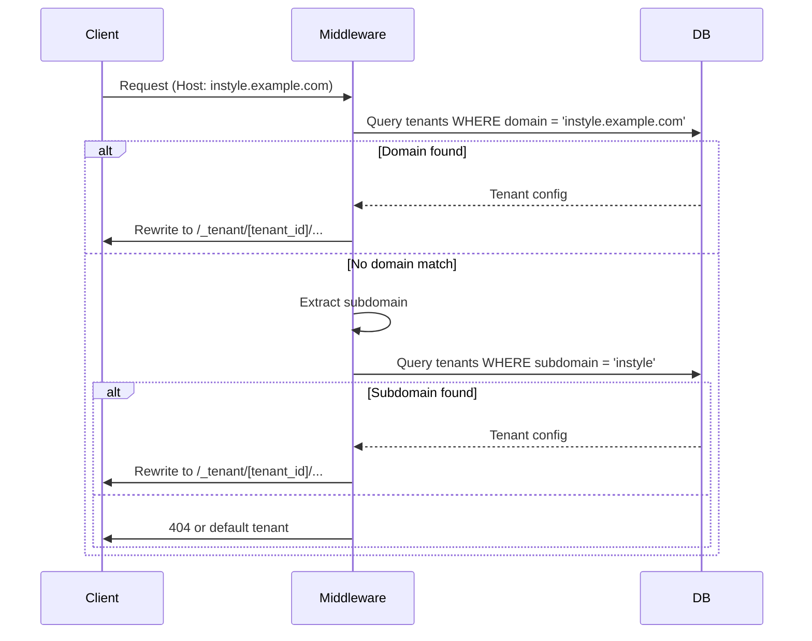
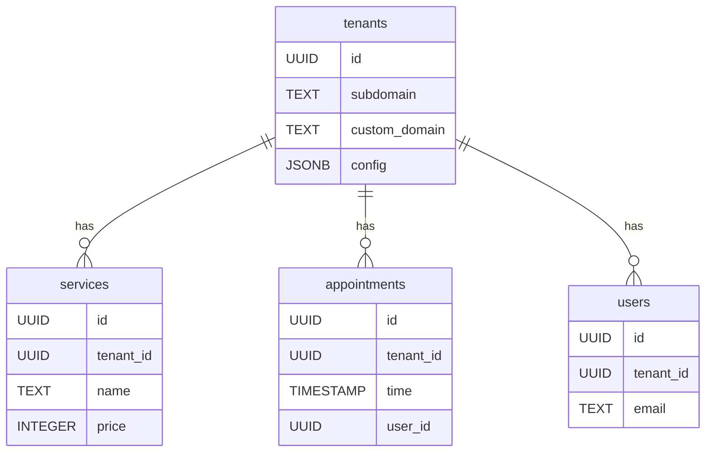
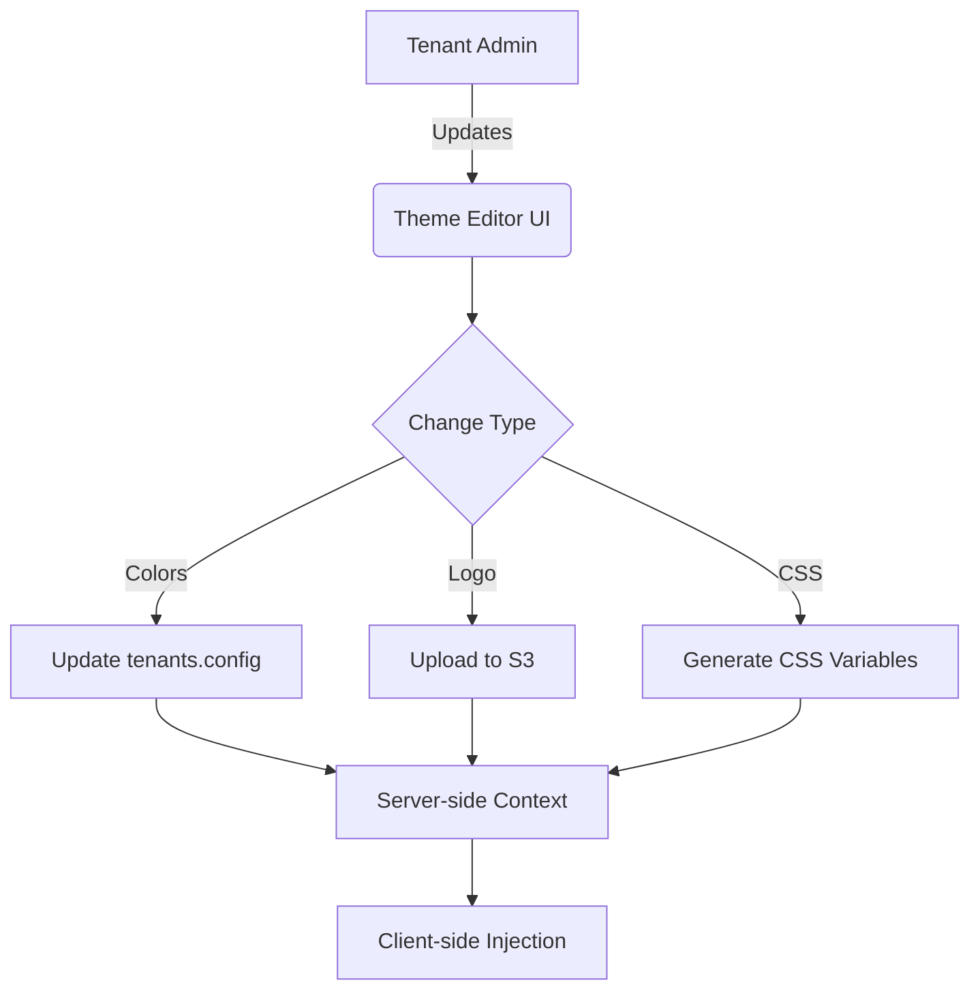

# Multi-Tenant SaaS Platform - Architecture Plan

## 1. Tenant Identification System
### Approach
- **Hybrid Resolution**: 
  - Primary: Custom domain → Tenant mapping via `tenants` table
  - Fallback: Subdomain pattern (client-name.your-platform-domain.com)
  - Development: Path-based (/instylehairboutique/*)

### Implementation


### Key Components
- `tenants` Table:
  ```sql
  CREATE TABLE tenants (
    id UUID PRIMARY KEY,
    subdomain TEXT UNIQUE,
    custom_domain TEXT UNIQUE,
    name TEXT,
    config JSONB
  );
  ```
- Enhanced Middleware (`app/middleware.js`):
  - Domain resolution with edge caching
  - Tenant context injection via Next.js rewrite headers

## 2. Data Isolation Strategy
### Supabase Schema Design


### Security Implementation
- Row Level Security (RLS) Policies:
  ```sql
  -- Services table policy
  CREATE POLICY "Tenant Data Access" ON services
  AS PERMISSIVE FOR ALL
  USING (tenant_id = current_tenant_id())
  WITH CHECK (tenant_id = current_tenant_id());
  ```

- Custom SQL Function:
  ```sql
  CREATE OR REPLACE FUNCTION current_tenant_id()
  RETURNS UUID AS $$
  BEGIN
    RETURN nullif(current_setting('app.current_tenant_id', true), '')::UUID;
  EXCEPTION WHEN others THEN
    RETURN null;
  END;
  $$ LANGUAGE plpgsql;
  ```

## 3. Branding Configuration
### Theme Management


### Storage Strategy
- **Database**: Theme colors, typography in `tenants.config`
- **S3 Bucket**: Tenant-specific assets path: `s3://branding/[tenant_id]/logo.png`
- **CSS Variables**:
  ```css
  :root {
    --primary: [tenant_primary];
    --secondary: [tenant_secondary];
  }
  ```

## 4. Tenant-Aware Authentication
### JWT Claims Structure
```json
{
  "sub": "user_uuid",
  "tenant_id": "tenant_uuid",
  "role": "customer|staff|admin",
  "tenant_role": "owner|manager|stylist"
}
```

### Auth Flow Enhancements
1. Signup: User must belong to a tenant (invite code or domain-bound)
2. Login: Session bound to tenant context
3. API Access: Middleware verifies user's tenant matches request context

### Supabase Client Wrapper
```javascript
// utils/supabase/tenant-client.js
export const createTenantClient = (tenantId) => {
  const client = createClient(
    process.env.NEXT_PUBLIC_SUPABASE_URL,
    process.env.NEXT_PUBLIC_SUPABASE_KEY
  );
  
  return client.setAuthHeaders({
    headers: {
      'X-Tenant-ID': tenantId
    }
  });
};
```

## Implementation Roadmap
1. Phase 1: Tenant Identification & Base Schema (2 weeks)
2. Phase 2: Branding System & Theme Engine (1 week)
3. Phase 3: Auth System Overhaul (1.5 weeks)
4. Phase 4: Migration Strategy (1 week)