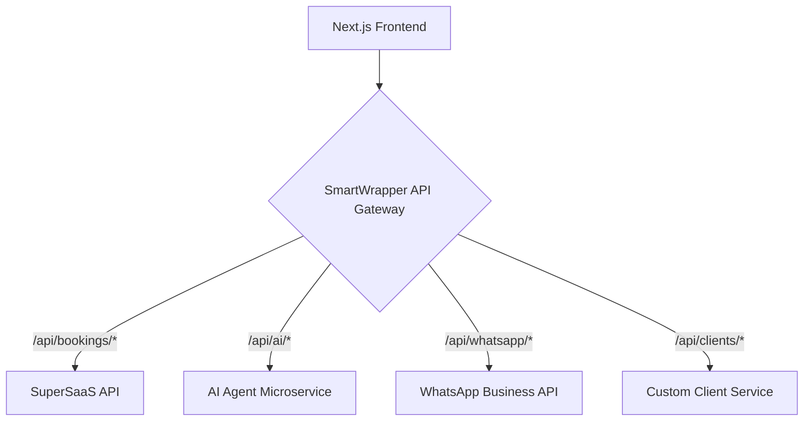

# Deliverable 3: Concrete Hybrid Strategy Action Plan

**Objective**: To provide a detailed action plan for implementing the hybrid wrapper architecture, enabling a gradual and seamless migration from the SuperSaaS reseller model to the custom AI platform.

## 1. "SmartWrapper" Architecture Diagram

The "SmartWrapper" is an API gateway that sits between the Next.js frontend and the various backend services. It will intelligently route requests to either the SuperSaaS API, the custom AI microservice, or the WhatsApp API.

## 2. Step-by-Step Wrapper Implementation Plan

This plan breaks down the implementation of the SmartWrapper into manageable phases.

**Phase 1: Initial Proxy (1-2 weeks)**

*   **Goal**: Get the SmartWrapper up and running as a simple proxy to the SuperSaaS API.
*   **Action**:
    1.  Create a new Node.js/Express.js application for the SmartWrapper.
    2.  Implement a single endpoint that forwards all requests to the SuperSaaS API.
    3.  Update the Next.js application to make all API calls to the SmartWrapper instead of directly to the SuperSaaS API.

**Phase 2: Custom Client Service (2-3 weeks)**

*   **Goal**: Replace the SuperSaaS client management with a custom service.
*   **Action**:
    1.  Create a new database schema for storing client data.
    2.  Build a new microservice (or add to the existing AI microservice) to handle all CRUD operations for clients.
    3.  Update the SmartWrapper to route all requests to `/api/clients/*` to the new custom client service.

**Phase 3: AI Microservice Integration (3-4 weeks)**

*   **Goal**: Integrate the AI microservice to provide intelligent features.
*   **Action**:
    1.  Deploy the AI microservice to a cloud provider.
    2.  Update the SmartWrapper to route all requests to `/api/ai/*` to the AI microservice.
    3.  Add new features to the Next.js application that leverage the AI microservice, such as personalized service recommendations.

**Phase 4: Full Migration (Ongoing)**

*   **Goal**: Gradually replace all SuperSaaS functionality with custom services.
*   **Action**: Continue to build out new custom services for features like staff management, reporting, and inventory management. As each new service is deployed, update the SmartWrapper to route the appropriate requests to the new service.

## 3. Data Synchronization and Migration Strategy

To ensure a smooth migration, it's essential to have a clear data synchronization and migration strategy.

**Data Synchronization:**

*   During the migration period, you will need to keep the data in the SuperSaaS system and your custom database in sync. This can be achieved by using a combination of webhooks and API calls.
*   For example, when a new client is created in your custom database, you can use the SuperSaaS API to create a corresponding client in the SuperSaaS system. Similarly, when a booking is made through the SuperSaaS widget, you can use a webhook to create a corresponding booking in your custom database.

**Data Migration:**

*   Once you have fully migrated to your custom platform, you will need to perform a one-time data migration from the SuperSaaS system to your custom database. This can be done by using the SuperSaaS API to export all of the data and then importing it into your custom database.
*   It's important to thoroughly test the data migration process to ensure that no data is lost or corrupted.
