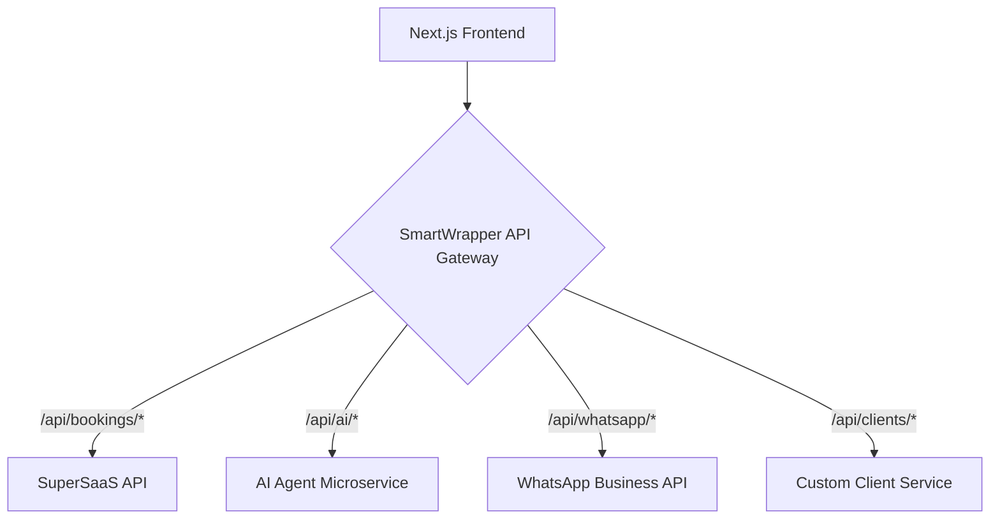

# Executive Strategic Acceleration Blueprint

## 1. Executive Summary

This blueprint provides a comprehensive strategic roadmap for the AI Salon Booking Platform. It outlines a clear action plan for the immediate onboarding of "InStyle Hair Boutique" while simultaneously laying the groundwork for a scalable and differentiated long-term platform.

The core strategy is a hybrid approach, leveraging the SuperSaaS reseller model for immediate revenue and market validation, while gradually migrating to a custom-built, multi-tenant SaaS platform. This approach minimizes risk, maximizes flexibility, and allows for the early introduction of AI-powered features.

**Key Recommendations:**

*   **Immediate Action:** Onboard "InStyle Hair Boutique" within 48-72 hours using the SuperSaaS Reseller MVP.
*   **Technical Strategy:** Implement a "SmartWrapper" API gateway to facilitate a seamless, phased migration to a custom backend.
*   **Product Differentiation:** Focus on high-impact AI and WhatsApp features to create a unique and compelling user experience.
*   **Execution:** Follow the aggressive 7-day sprint plan to ensure rapid progress and a successful launch.

This blueprint is designed to be a living document, providing a clear path forward for both the business and technical teams. By following the recommendations outlined in this document, the AI Salon Booking Platform can achieve its ambitious goals and become a leader in the salon management software market.

---

## 2. Immediate Action Plan: Emergency MVP for "InStyle Hair Boutique"

**Objective**: Onboard "InStyle Hair Boutique" within 48-72 hours with a functional and professional-looking booking solution.

### 2.1. Client Communication Strategy: Framing as "Phase 1"

It's crucial to set the right expectations with InStyle. Frame this initial offering as "Phase 1" of their platform, emphasizing that this is a rapid rollout to get them operational immediately, with more advanced, AI-powered features to follow in "Phase 2."

**Sample Client Communication Message:**

> "Hi [Client Name],
>
> We are incredibly excited to partner with you and get InStyle Hair Boutique set up on our platform. To get you accepting online bookings as quickly as possible, we're initiating **Phase 1** of your onboarding.
>
> Within the next 48 hours, we will provide you with a fully functional and branded online booking system. This will allow your clients to book appointments seamlessly from your website.
>
> While we are rolling out this robust booking engine, our team will be working on **Phase 2** in the background, which will introduce our advanced AI features to further enhance your business operations.
>
> We will be in touch shortly with your new booking system link and login details.
>
> Best regards,
> The [Your Company Name] Team"

### 2.2. Minimum Viable Features & Execution Plan

The fastest path to a professional-looking MVP is to use the SuperSaaS reseller account and embed its booking widget into a simple, polished landing page within your existing Next.js application.

**Execution Plan (48 Hours):**

1.  **Day 1 AM:**
    *   Sign up for the SuperSaaS reseller program.
    *   Create a white-labeled account for "InStyle Hair Boutique".
    *   Configure the account with InStyle's services, staff, and business hours.
    *   Get the booking widget embed code from the SuperSaaS dashboard.

2.  **Day 1 PM:**
    *   Create a new, simple, and elegant "Coming Soon" or "Home" page in your `appointmentbooking.git` repository.
    *   Embed the SuperSaaS booking widget into this new page.
    *   Polish the UI of the `Layout.jsx` to ensure a professional look and feel.

3.  **Day 2 AM:**
    *   Deploy the updated Next.js application.
    *   Thoroughly test the booking flow.
    *   Send the client their login details and the link to their new booking page.

### 2.3. Specific Code Snippets for Emergency Components

Here are the code snippets to quickly create the necessary components in your Next.js application.

#### `pages/index.jsx` (New Homepage with Embedded Booking)

```jsx
import Head from 'next/head';
import Layout from '../components/Layout';

export default function Home() {
  return (
    <Layout>
      <Head>
        <title>InStyle Hair Boutique - Book Your Appointment</title>
      </Head>
      <div className="container mx-auto px-4 py-16 text-center">
        <h1 className="text-4xl font-bold text-gray-800">InStyle Hair Boutique</h1>
        <p className="text-lg text-gray-600 mt-4">
          Your style, our passion. Book your appointment with our expert stylists below.
        </p>
      </div>
      <div className="container mx-auto px-4">
        {/* This is where you embed the SuperSaaS widget */}
        <iframe
          src="YOUR_SUPERSAAS_WIDGET_URL"
          width="100%"
          height="600"
          frameBorder="0"
          style={{ border: 'none', minHeight: '600px' }}
        />
      </div>
    </Layout>
  );
}
```

#### `components/Layout.jsx` (Polished Layout)

```jsx
import React from 'react';

const Layout = ({ children }) => {
  return (
    <div className="min-h-screen bg-gray-50">
      <header className="bg-white shadow-sm">
        <div className="container mx-auto px-4 py-4">
          <h1 className="text-2xl font-bold text-gray-800">[Your Company Logo/Name]</h1>
        </div>
      </header>
      <main>{children}</main>
      <footer className="bg-white mt-16">
        <div className="container mx-auto px-4 py-6 text-center text-gray-600">
          <p>&copy; {new Date().getFullYear()} InStyle Hair Boutique. Powered by [Your Company Name].</p>
        </div>
      </footer>
    </div>
  );
};

export default Layout;
```

---

## 3. Technical Implementation: Prioritized Code Refinement Plan

**Objective**: To outline the necessary code improvements for both repositories to enhance the UI/UX of the main application and prepare the AI microservice for deployment.

### 3.1. `appointmentbooking.git` (Next.js Main App)

This plan focuses on polishing the user-facing application to create a professional and intuitive experience.

#### `pages/index.jsx` - Homepage

*   **Current State**: Needs a polished homepage.
*   **Action**: Implement the new homepage design with the embedded SuperSaaS widget, as outlined in the Emergency MVP Plan. This page should be visually appealing and clearly communicate the salon's brand.

#### `components/Layout.jsx` - Global Layout

*   **Current State**: Basic layout.
*   **Action**: Refine the layout to include a professional header and footer. The header should contain your company's logo and branding, and the footer should have the appropriate copyright and contact information. Ensure the layout is responsive and looks good on all devices.

#### Salon Dashboard (New Component)

*   **Current State**: Does not exist.
*   **Action**: Create a new dashboard component for salon owners. This will be the main interface for them to manage their bookings, clients, and staff. The initial version of the dashboard can be simple, with a focus on displaying the key information from the SuperSaaS API. This will be a critical component for the long-term custom platform.

**Example Dashboard Component Structure:**

```jsx
// pages/dashboard.jsx
import Layout from '../components/Layout';
import { useEffect, useState } from 'react';

export default function Dashboard() {
  const [appointments, setAppointments] = useState([]);

  useEffect(() => {
    // Fetch appointments from your hybrid wrapper API
    // const fetchedAppointments = await fetch('/api/appointments');
    // setAppointments(await fetchedAppointments.json());
  }, []);

  return (
    <Layout>
      <div className="container mx-auto px-4 py-8">
        <h1 className="text-3xl font-bold text-gray-800">Salon Dashboard</h1>
        <div className="mt-8">
          <h2 className="text-2xl font-bold text-gray-700">Upcoming Appointments</h2>
          {/* Display appointments here */}
        </div>
      </div>
    </Layout>
  );
}
```

### 3.2. `appointmentbookings.agent.git` (Python/FastAPI AI Microservice)

This plan focuses on preparing the AI microservice for deployment and integration with the main application.

#### API Contract (OpenAPI Specification)

*   **Current State**: Needs a formal API contract.
*   **Action**: Define a clear and comprehensive OpenAPI specification for the AI microservice. This will ensure that the frontend and backend teams are aligned on the API endpoints, request/response formats, and data models.

**Example OpenAPI Specification (`openapi.yaml`):**

```yaml
openapi: 3.0.0
info:
  title: AI Salon Booking Agent API
  version: 1.0.0
paths:
  /recommendations:
    get:
      summary: Get personalized service recommendations for a client
      parameters:
        - name: client_id
          in: query
          required: true
          schema:
            type: string
      responses:
        '200':
          description: A list of recommended services
          content:
            application/json:
              schema:
                type: array
                items:
                  type: object
                  properties:
                    service_name: 
                      type: string
                    reason: 
                      type: string
```

#### Dockerfile

*   **Current State**: Needs a Dockerfile for containerization.
*   **Action**: Create a `Dockerfile` to containerize the FastAPI application. This will ensure that the application can be deployed consistently and reliably across different environments.

**Example `Dockerfile`:**

```dockerfile
FROM python:3.9-slim

WORKDIR /app

COPY requirements.txt requirements.txt
RUN pip install -r requirements.txt

COPY . .

CMD ["uvicorn", "main:app", "--host", "0.0.0.0", "--port", "8000"]
```

#### Deployment Strategy

*   **Current State**: Needs a deployment strategy.
*   **Action**: Choose a cloud provider (e.g., AWS, Google Cloud, Azure) and a deployment method (e.g., Docker Swarm, Kubernetes, serverless). For a simple microservice, a serverless platform like Google Cloud Run or AWS Fargate can be a good starting point. Create a deployment script or a CI/CD pipeline to automate the deployment process.

---

## 4. Strategic Architecture: Hybrid Platform Approach

**Objective**: To provide a detailed action plan for implementing the hybrid wrapper architecture, enabling a gradual and seamless migration from the SuperSaaS reseller model to the custom AI platform.

### 4.1. "SmartWrapper" Architecture Diagram

The "SmartWrapper" is an API gateway that sits between the Next.js frontend and the various backend services. It will intelligently route requests to either the SuperSaaS API, the custom AI microservice, or the WhatsApp API.



### 4.2. Step-by-Step Wrapper Implementation Plan

This plan breaks down the implementation of the SmartWrapper into manageable phases.

**Phase 1: Initial Proxy (1-2 weeks)**

*   **Goal**: Get the SmartWrapper up and running as a simple proxy to the SuperSaaS API.
*   **Action**:
    1.  Create a new Node.js/Express.js application for the SmartWrapper.
    2.  Implement a single endpoint that forwards all requests to the SuperSaaS API.
    3.  Update the Next.js application to make all API calls to the SmartWrapper instead of directly to the SuperSaaS API.

**Phase 2: Custom Client Service (2-3 weeks)**

*   **Goal**: Replace the SuperSaaS client management with a custom service.
*   **Action**:
    1.  Create a new database schema for storing client data.
    2.  Build a new microservice (or add to the existing AI microservice) to handle all CRUD operations for clients.
    3.  Update the SmartWrapper to route all requests to `/api/clients/*` to the new custom client service.

**Phase 3: AI Microservice Integration (3-4 weeks)**

*   **Goal**: Integrate the AI microservice to provide intelligent features.
*   **Action**:
    1.  Deploy the AI microservice to a cloud provider.
    2.  Update the SmartWrapper to route all requests to `/api/ai/*` to the AI microservice.
    3.  Add new features to the Next.js application that leverage the AI microservice, such as personalized service recommendations.

**Phase 4: Full Migration (Ongoing)**

*   **Goal**: Gradually replace all SuperSaaS functionality with custom services.
*   **Action**: Continue to build out new custom services for features like staff management, reporting, and inventory management. As each new service is deployed, update the SmartWrapper to route the appropriate requests to the new service.

### 4.3. Data Synchronization and Migration Strategy

To ensure a smooth migration, it's essential to have a clear data synchronization and migration strategy.

**Data Synchronization:**

*   During the migration period, you will need to keep the data in the SuperSaaS system and your custom database in sync. This can be achieved by using a combination of webhooks and API calls.
*   For example, when a new client is created in your custom database, you can use the SuperSaaS API to create a corresponding client in the SuperSaaS system. Similarly, when a booking is made through the SuperSaaS widget, you can use a webhook to create a corresponding booking in your custom database.

**Data Migration:**

*   Once you have fully migrated to your custom platform, you will need to perform a one-time data migration from the SuperSaaS system to your custom database. This can be done by using the SuperSaaS API to export all of the data and then importing it into your custom database.
*   It's important to thoroughly test the data migration process to ensure that no data is lost or corrupted.

---

## 5. WhatsApp Integration: High-Impact API Strategy

**Objective**: To outline the top three high-impact use cases for the WhatsApp Business API, providing a clear implementation plan for each.

### 5.1. Use Case 1: AI-Powered Onboarding Assistant

**Goal**: To provide a personalized and interactive onboarding experience for new clients.

**Message Flow:**

1.  **Client Signs Up:** When a new client signs up for the service, they receive a welcome message on WhatsApp.
2.  **AI Onboarding Assistant:** The AI assistant asks the client a series of questions to understand their needs and preferences.
3.  **Personalized Recommendations:** Based on the client's answers, the AI assistant provides personalized recommendations for services and products.
4.  **Book First Appointment:** The client can book their first appointment directly from the WhatsApp chat.

**API Call Structure:**

```json
{
  "to": "[CLIENT_WHATSAPP_NUMBER]",
  "type": "template",
  "template": {
    "name": "welcome_onboarding",
    "language": {
      "code": "en_US"
    },
    "components": [
      {
        "type": "body",
        "parameters": [
          {
            "type": "text",
            "text": "[CLIENT_NAME]"
          }
        ]
      }
    ]
  }
}
```

**Integration with AI Agent:**

The AI agent service will be used to power the onboarding assistant. The agent will be responsible for understanding the client's needs, providing personalized recommendations, and guiding them through the booking process.

### 5.2. Use Case 2: Interactive Booking Confirmations and Reminders

**Goal**: To reduce no-shows and improve client communication.

**Message Flow:**

1.  **Booking Confirmation:** When a client books an appointment, they receive an interactive confirmation message on WhatsApp.
2.  **Confirm or Reschedule:** The client can confirm, reschedule, or cancel the appointment directly from the WhatsApp chat.
3.  **Appointment Reminder:** The day before the appointment, the client receives a reminder message with the option to get directions to the salon.

**API Call Structure:**

```json
{
  "to": "[CLIENT_WHATSAPP_NUMBER]",
  "type": "interactive",
  "interactive": {
    "type": "button",
    "body": {
      "text": "Hi [CLIENT_NAME], your appointment is confirmed for [DATE] at [TIME]."
    },
    "action": {
      "buttons": [
        {
          "type": "reply",
          "reply": {
            "id": "CONFIRM_APPOINTMENT",
            "title": "Confirm"
          }
        },
        {
          "type": "reply",
          "reply": {
            "id": "RESCHEDULE_APPOINTMENT",
            "title": "Reschedule"
          }
        }
      ]
    }
  }
}
```

### 5.3. Use Case 3: Targeted Promotional Blasts

**Goal**: To increase client retention and drive repeat business.

**Message Flow:**

1.  **AI-Powered Segmentation:** The AI agent segments clients based on their booking history, preferences, and other data.
2.  **Targeted Promotions:** The salon sends targeted promotional blasts to specific client segments with personalized offers and discounts.
3.  **Book Now:** The client can book the promotional offer directly from the WhatsApp chat.

**API Call Structure:**

```json
{
  "to": "[CLIENT_WHATSAPP_NUMBER]",
  "type": "template",
  "template": {
    "name": "promotional_offer",
    "language": {
      "code": "en_US"
    },
    "components": [
      {
        "type": "body",
        "parameters": [
          {
            "type": "text",
            "text": "[CLIENT_NAME]"
          },
          {
            "type": "text",
            "text": "[PROMOTIONAL_OFFER]"
          }
        ]
      }
    ]
  }
}
```

**Integration with AI Agent:**

The AI agent will be used to segment clients and personalize the promotional offers. This will ensure that the promotions are relevant and effective.

---

## 6. 7-Day Sprint: Daily Execution Roadmap

**Objective**: To provide a detailed 7-day sprint plan that balances immediate client needs with long-term platform development.

**End-State Outcome**: By the end of this 7-day sprint, "InStyle Hair Boutique" will be successfully onboarded and using the platform for online bookings. The development team will have a clear roadmap for the next phase of development, and the foundation for the custom platform will be in place.

### **Day 1: Emergency MVP Launch**

*   **Client Focus:**
    *   [ ] Communicate "Phase 1" launch to InStyle Hair Boutique.
    *   [ ] Set up their SuperSaaS reseller account.
    *   [ ] Configure their services, staff, and schedule.
*   **Development Focus:**
    *   [ ] Create the new `pages/index.jsx` with the embedded SuperSaaS widget.
    *   [ ] Polish the `components/Layout.jsx`.
    *   [ ] Deploy the updated Next.js application.
*   **Strategic Focus:**
    *   [ ] Finalize the prioritized code refinement plan.

### **Day 2: Client Onboarding & Feedback**

*   **Client Focus:**
    *   [ ] Send login details and booking link to InStyle.
    *   [ ] Conduct a virtual onboarding and training session.
    *   [ ] Actively solicit feedback on the booking experience.
*   **Development Focus:**
    *   [ ] Begin work on the SmartWrapper API gateway (Phase 1).
    *   [ ] Create the initial OpenAPI specification for the AI microservice.
*   **Strategic Focus:**
    *   [ ] Solidify the hybrid strategy action plan.

### **Day 3: Stabilize & Strategize**

*   **Client Focus:**
    *   [ ] Follow up with InStyle to address any questions or issues.
    *   [ ] Monitor booking activity.
*   **Development Focus:**
    *   [ ] Continue development of the SmartWrapper API gateway.
    *   [ ] Create the `Dockerfile` for the AI microservice.
*   **Strategic Focus:**
    *   [ ] Begin drafting the high-impact WhatsApp API strategy.

### **Day 4: First Custom Service**

*   **Client Focus:**
    *   [ ] Send a "Week 1 Check-in" email to InStyle.
*   **Development Focus:**
    *   [ ] Begin development of the custom client service (Phase 2 of the hybrid plan).
    *   [ ] Design the database schema for the client service.
*   **Strategic Focus:**
    *   [ ] Refine the WhatsApp API strategy with specific message flows.

### **Day 5: AI Integration Planning**

*   **Client Focus:**
    *   [ ] Share a sneak peek of the upcoming "Phase 2" AI features.
*   **Development Focus:**
    *   [ ] Continue development of the custom client service.
    *   [ ] Plan the integration of the AI microservice with the SmartWrapper.
*   **Strategic Focus:**
    *   [ ] Finalize the WhatsApp API strategy document.

### **Day 6: Architecture & Deployment**

*   **Client Focus:**
    *   [ ] No direct client interaction planned.
*   **Development Focus:**
    *   [ ] Complete the initial version of the custom client service.
    *   [ ] Choose a deployment strategy for the AI microservice and the SmartWrapper.
*   **Strategic Focus:**
    *   [ ] Review and finalize all five deliverable documents.

### **Day 7: Sprint Review & Next Steps**

*   **Client Focus:**
    *   [ ] Send a summary of the first week's activity to InStyle.
*   **Development Focus:**
    *   [ ] Demo the progress on the SmartWrapper and the custom client service.
    *   [ ] Plan the next sprint, focusing on the continued build-out of the custom platform.
*   **Strategic Focus:**
    *   [ ] Present the completed strategic blueprint to the stakeholders.

---

## 7. Success Metrics

**Objective**: To define clear Key Performance Indicators (KPIs) and milestones to track the success of the AI Salon Booking Platform.

**Short-Term (0-3 Months):**

*   **Client Onboarding:**
    *   Onboard "InStyle Hair Boutique" within 72 hours.
    *   Achieve a client satisfaction score of 4.5/5 or higher.
*   **MVP Performance:**
    *   100% uptime for the booking widget.
    *   Successful processing of at least 50 bookings in the first month.
*   **Development Progress:**
    *   Complete Phase 1 of the SmartWrapper implementation.
    *   Deploy the AI microservice to a staging environment.

**Long-Term (3-12 Months):**

*   **Client Growth:**
    *   Onboard 10 new salons.
    *   Achieve a monthly recurring revenue (MRR) of $5,000.
*   **Platform Adoption:**
    *   Achieve a 90% adoption rate of the online booking feature among clients.
    *   Achieve a 50% adoption rate of the AI-powered features.
*   **Product Development:**
    *   Complete the full migration to the custom platform.
    *   Launch the WhatsApp integration.

---

## 8. Risk Mitigation

**Objective**: To identify potential challenges and provide a clear plan for mitigating them.

| Risk | Likelihood | Impact | Mitigation Plan |
| :--- | :--- | :--- | :--- |
| **Client Churn** | Medium | High | *   Provide excellent customer support.<br>*   Continuously deliver new and valuable features.<br>*   Actively solicit and act on client feedback. |
| **Technical Debt** | High | Medium | *   Follow a strict code review process.<br>*   Prioritize refactoring and code quality.<br>*   Use a modular architecture to isolate technical debt. |
| **Competitor Pressure** | High | High | *   Focus on a clear differentiation strategy.<br>*   Continuously innovate and improve the product.<br>*   Build a strong brand and a loyal customer base. |
| **Data Security Breach** | Low | High | *   Implement robust security measures, including encryption and access control.<br>*   Regularly audit the security of the platform.<br>*   Comply with all relevant data privacy regulations. |
