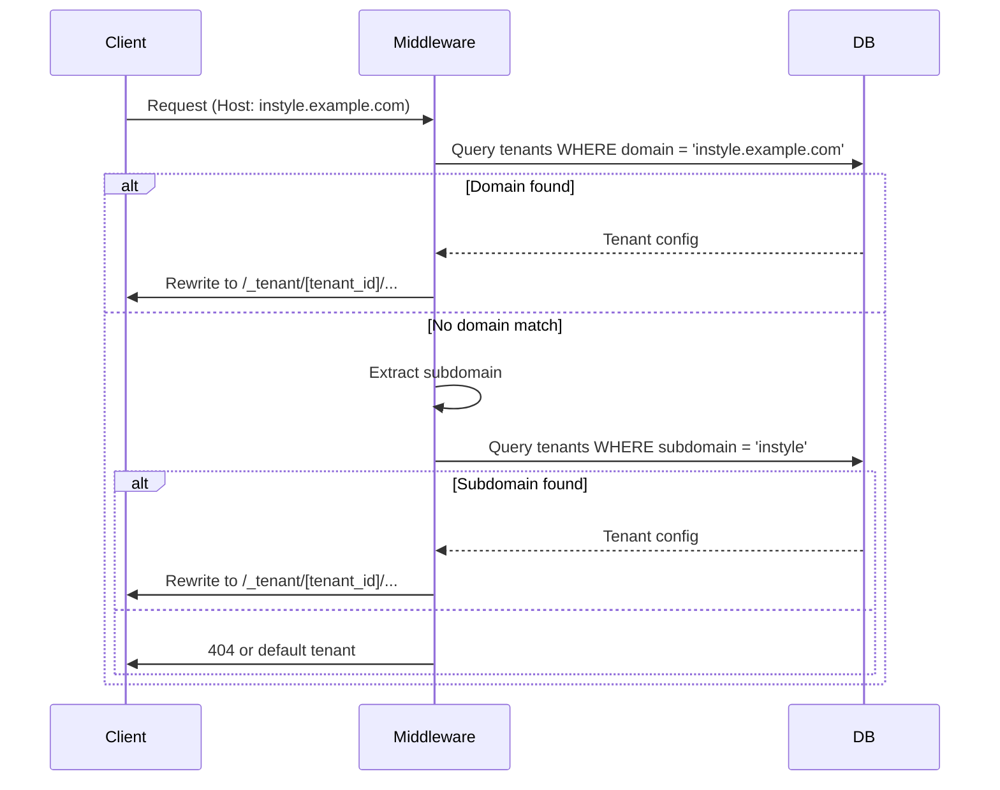
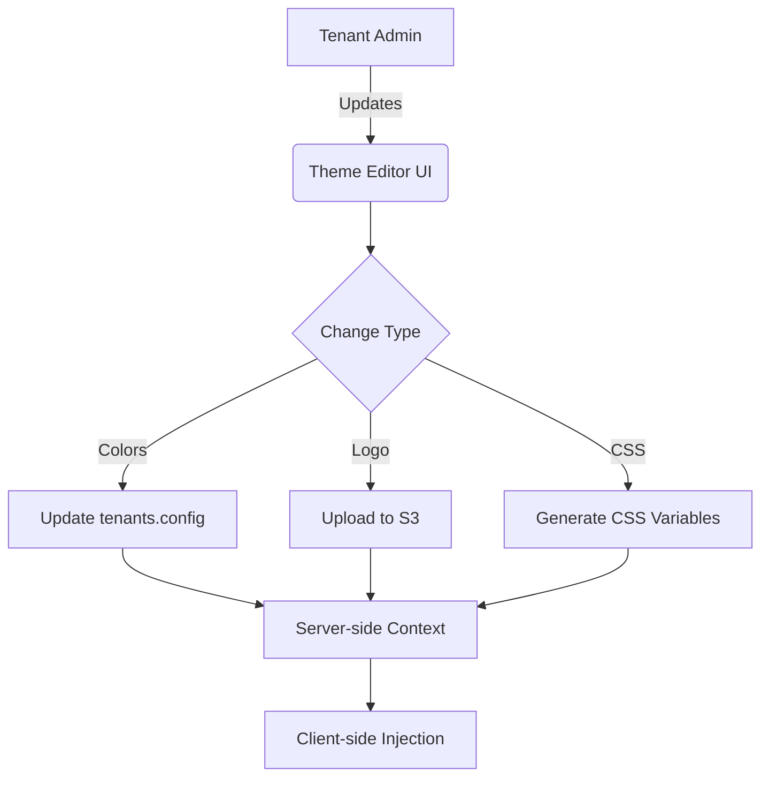

# Multi-Tenant Architecture Plan

## 1. Tenant Identification System
### Approach
- **Hybrid Resolution**: 
  - Primary: Custom domain → Tenant mapping via `tenants` table
  - Fallback: Subdomain pattern (client-name.appointmentbooking.co.za)
  - Development: Path-based (/instylehairboutique/*)

### Implementation


### Key Components
- `tenants` Table:
  ```sql
  CREATE TABLE tenants (
    id UUID PRIMARY KEY,
    subdomain TEXT UNIQUE,
    custom_domain TEXT UNIQUE,
    name TEXT,
    config JSONB
  );
  ```
- Enhanced Middleware (`app/middleware.js`):
  - Domain resolution with edge caching
  - Tenant context injection via Next.js rewrite headers

## 2. Data Isolation Strategy
### Supabase Schema Design
```mermaid
rDiagram
    tenants ||--o{ services : has
    tenants ||--o{ appointments : has
    tenants ||--o{ users : has
    
    tenants {
        UUID id
        TEXT subdomain
        TEXT custom_domain
        JSONB config
    }
    
    services {
        UUID id
        UUID tenant_id
        TEXT name
        INTEGER price
    }
    
    appointments {
        UUID id
        UUID tenant_id
        TIMESTAMP time
        UUID user_id
    }
    
    users {
        UUID id
        UUID tenant_id
        TEXT email
    }
```

### Security Implementation
- Row Level Security (RLS) Policies:
  ```sql
  -- Services table policy
  CREATE POLICY "Tenant Data Access" ON services
  AS PERMISSIVE FOR ALL
  USING (tenant_id = current_tenant_id())
  WITH CHECK (tenant_id = current_tenant_id());
  ```

- Custom SQL Function:
  ```sql
  CREATE OR REPLACE FUNCTION current_tenant_id()
  RETURNS UUID AS $$
  BEGIN
    RETURN nullif(current_setting('app.current_tenant_id', true), '')::UUID;
  EXCEPTION WHEN others THEN
    RETURN null;
  END;
  $$ LANGUAGE plpgsql;
  ```

## 3. Branding Configuration
### Theme Management


### Storage Strategy
- **Database**: Theme colors, typography in `tenants.config`
- **S3 Bucket**: Tenant-specific assets path: `s3://branding/[tenant_id]/logo.png`
- **CSS Variables**:
  ```css
  :root {
    --primary: [tenant_primary];
    --secondary: [tenant_secondary];
  }
  ```

## 4. Tenant-Aware Authentication
### JWT Claims Structure
```json
{
  "sub": "user_uuid",
  "tenant_id": "tenant_uuid",
  "role": "customer|staff|admin",
  "tenant_role": "owner|manager|stylist"
}
```

### Auth Flow Enhancements
1. Signup: User must belong to a tenant (invite code or domain-bound)
2. Login: Session bound to tenant context
3. API Access: Middleware verifies user's tenant matches request context

### Supabase Client Wrapper
```javascript
// utils/supabase/tenant-client.js
export const createTenantClient = (tenantId) => {
  const client = createClient(
    process.env.NEXT_PUBLIC_SUPABASE_URL,
    process.env.NEXT_PUBLIC_SUPABASE_KEY
  );
  
  return client.setAuthHeaders({
    headers: {
      'X-Tenant-ID': tenantId
    }
  });
};
```

## Implementation Roadmap
1. Phase 1: Tenant Identification & Base Schema (2 weeks)
2. Phase 2: Branding System & Theme Engine (1 week)
3. Phase 3: Auth System Overhaul (1.5 weeks)
4. Phase 4: Migration Strategy (1 week)

# The Platform Brownfield Enhancement PRD

## Introduction

This document captures the CURRENT STATE of the AppointmentBookings.co.za codebase, including technical debt, workarounds, and real-world patterns. It serves as a reference for AI agents working on enhancements.

### Document Scope

Comprehensive documentation of the entire system, focusing on the multi-tenant Next.js application and its integration points with external microservices.

### Change Log

| Date | Version | Description | Author |
|---|---|---|---|
| 21 July 2025 | 1.0 | Initial brownfield analysis | Product Manager |

## Quick Reference - Key Files and Entry Points

### Critical Files for Understanding the System

*   **Main Entry**: `app/layout.js`, `app/page.jsx` (Next.js entry points)
*   **Configuration**: `next.config.mjs`, `tailwind.config.js`, `postcss.config.js`, `jsconfig.json`, `tsconfig.json`
*   **Core Business Logic**: `app/lib/agent-functions.js`, `lib/api.ts`, `lib/supabase.ts`
*   **API Definitions**: `app/api/` directory (Next.js API routes)
*   **Database Models**: `prisma/schema.prisma`
*   **Key Architecture**: `ARCHITECTURE.md`
*   **Main Application Dependencies**: `package.json`

## High Level Architecture

### Technical Summary

This project is a multi-tenant AI-powered SaaS platform for salon management, built with Next.js. It is designed to provide a scalable and customizable solution for businesses to manage their appointments, with each tenant operating under their own isolated environment. The platform integrates with external microservices (Nia, Blaze, Orion, Wellness) for specialized functionalities, which are not part of this repository.

### Actual Tech Stack (from package.json/requirements.txt)

| Category | Technology | Version | Notes |
|---|---|---|---|
| Runtime | Node.js | 20.x | Defined in `package.json` engines |
| Framework | Next.js | 15.2.4 | |
| Database & Auth | Supabase | latest | Used for database and authentication |
| ORM | Prisma | 6.12.0 | |
| Styling | Tailwind CSS | 3.4.17 | |
| UI Components | Radix UI | various | Extensive use of Radix UI components |
| State Management | Zustand | 5.0.6 | |
| Form Handling | React Hook Form, Zod | 7.54.1, 3.24.1 | |
| Date/Time | date-fns | 3.6.0 | |
| AI Integration | openai | 5.10.0 | For potential AI-driven features |
| Payments | stripe | 18.3.0 | For payment processing |
| Testing | Jest | (dev dependency) | Defined in `jest.config.js` |
| Language | TypeScript | 5 | Defined in `tsconfig.json` |

### Repository Structure Reality Check

*   Type: Hybrid (Monorepo-like structure for frontend, integrates with external microservices)
*   Package Manager: npm
*   Notable: The `services` directory currently only contains `n8n`, indicating that other microservices (Nia, Blaze, Orion, Wellness) are external to this repository.

## Source Tree and Module Organization

### Project Structure (Actual)

```text
your-platform-repo/
├── app/                 # Next.js application pages, API routes, and core logic
│   ├── api/             # Next.js API routes
│   ├── lib/             # Core application logic and helper functions
│   └── ...
├── components/          # Reusable React components
├── contexts/            # React Contexts for global state
├── dashboard/           # Dashboard specific components/pages
├── hooks/               # Custom React hooks
├── lib/                 # Shared utility functions and configurations
├── packages/db/         # Prisma schema and database related files
├── prisma/              # Prisma ORM configuration
├── public/              # Static assets
├── scripts/             # Utility scripts
├── services/            # External service integrations (currently only n8n)
├── styles/              # Global CSS
├── supabase/            # Supabase migrations
├── types/               # TypeScript type definitions
├── utils/               # General utility functions
└── ...
```

### Key Modules and Their Purpose

*   **`app/`**: Contains the main Next.js application, including pages, API routes, and core application logic.
*   **`components/`**: Houses reusable UI components built with React and Radix UI.
*   **`lib/`**: Contains shared utility functions, API clients, and Supabase configurations. `agent-functions.js` is a key file here for booking and product search.
*   **`prisma/`**: Defines the database schema and Prisma client for database interactions.
*   **`services/n8n/`**: Integration for the n8n workflow automation tool.
*   **`ARCHITECTURE.md`**: Provides a high-level overview of the multi-tenant architecture, data isolation, and authentication.

## Data Models and APIs

### Data Models

*   **User Model**: Defined in `prisma/schema.prisma` and managed by Supabase Auth.
*   **Tenant Model**: Defined in `prisma/schema.prisma`, crucial for multi-tenancy.
*   **Appointments, Services, Products**: Defined in `prisma/schema.prisma`.
*   **Related Types**: TypeScript definitions in `types/index.ts`.

### API Specifications

*   **Next.js API Routes**: Located in `app/api/` directory. These are the primary internal APIs.
*   **Supabase API**: Used for direct database interactions and authentication.
*   **External Microservices APIs**: The platform integrates with external microservices (Nia, Blaze, Orion, Wellness) via their respective APIs (e.g., `/api/v1/[tenant]/wh`). These APIs are external to this repository.

## Technical Debt and Known Issues

### Critical Technical Debt

*   **External Microservices**: The code for Nia, Blaze, Orion, and Wellness microservices is not present in this repository, making it difficult to fully understand and manage their implementation details from within this project.
*   **Simplified Availability**: `getAvailableAppointments` in `app/lib/agent-functions.js` uses simplified availability, which needs to be replaced with a proper calendar integration for production.
*   **Webhook Error Handling**: The `bookAppointment` function in `app/lib/agent-functions.js` has basic webhook error handling, but more robust retry mechanisms and logging might be needed.

### Workarounds and Gotchas

*   **Tenant Identification**: The `ARCHITECTURE.md` outlines a hybrid approach for tenant identification (custom domain, subdomain, path-based), which needs to be carefully managed.
*   **Supabase Service Role Key**: The use of `SUPABASE_SERVICE_ROLE_KEY` in `app/lib/agent-functions.js` for direct Supabase access requires careful security considerations.

## Integration Points and External Dependencies

### External Services

| Service | Purpose | Integration Type | Key Files/Notes |
|---|---|---|---|
| Supabase | Database, Authentication | SDK/API | `lib/supabase.ts`, `app/lib/agent-functions.js` |
| Stripe | Payments | SDK/API | `package.json` dependency |
| OpenAI | AI Integration | SDK/API | `package.json` dependency |
| Nia (booking bot) | WhatsApp booking, slot, confirmation | External Microservice API | Integrated via `/api/v1/[tenant]/wh` |
| Blaze (marketing) | Auto IG / SMS campaign | External Microservice API | Integrated via `/api/v1/[tenant]/campaign` |
| Orion (upsell) | Product bundle suggest | External Microservice API | Integrated via `/api/v1/[tenant]/upsell` |
| Wellness (mental-health) | Intake, SOAP notes, risk | External Microservice API | Integrated via `/api/v1/[tenant]/intake` |
| n8n | Workflow automation | Local service/Integration | `services/n8n/` |

### Internal Integration Points

*   **Next.js API Routes**: Used for internal communication within the Next.js application and as endpoints for external services.
*   **Supabase RLS**: Ensures data isolation between tenants.
*   **Tenant-Aware Authentication**: JWT claims include tenant context for secure access.

## Development and Deployment

### Local Development Setup

*   **Build Command**: `npm run build` (uses `npx prisma generate && next build`)
*   **Dev Command**: `npm run dev` (starts Next.js development server)
*   **Docker Compose**: `docker-compose.yml` defines a `frontend` service for local development.

### Build and Deployment Process

*   **Containerization**: The `Dockerfile` in the root directory is used to containerize the Next.js application.
*   **Deployment**: The provided information suggests deployment to Fly.io for microservices, but the main Next.js application's deployment process is not explicitly detailed in the analyzed files.

## Testing Reality

### Current Test Coverage

*   `jest.config.js` indicates Jest is used for testing.
*   No explicit test coverage reports were found in the analyzed files.

### Running Tests

```bash
npm test # (Likely runs Jest tests based on jest.config.js)
```

## Appendix - Useful Commands and Scripts

### Frequently Used Commands

```bash
npm run dev         # Start development server
npm run build       # Production build
npm run lint        # Run Next.js linter
npm run start       # Start Next.js production server
```