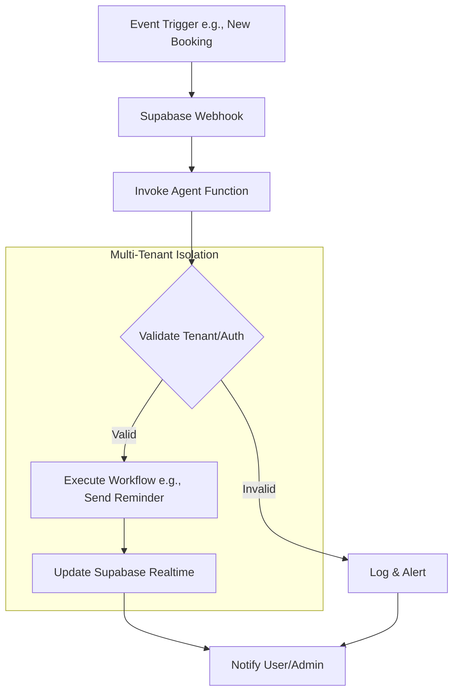

# Spec: Agent Integration v1.0

## Changelog
- **v1.0 (2025-10-01)**: Initial specification for integrating AI agents into the multi-tenant platform, resolving audit issues like incomplete agent repo (auth mismatches, no multi-tenancy) and aligning with booking/agent flows. Prioritizes open-source/freemium tools for agent ops.

## Overview
This specification outlines the integration of AI agents for automation in the multi-tenant appointment booking platform, enabling features like automated reminders, chat support, and analytics. Agents will run in a dedicated repo (e.g., your-platform-agent), synced with the main platform via Supabase for realtime data and Clerk for auth. It addresses audit gaps: Auth alignment to fix mismatches, multi-tenancy via RLS, and incomplete implementations by standardizing agent workflows. Freemium tools (e.g., LangChain open-source, Supabase Edge Functions) ensure minimal lock-in; migrate any Firebase realtime to Supabase. Goals: Production-ready with IaC (Terraform for agent infra), tests for agent reliability, and rollback to prevent service disruptions.

Key benefits:
- Tenant-isolated agents (e.g., Instyle: WhatsApp reminders; new tenant: custom chatbots).
- Automates high-priority fixes: Deploy recovery via agent monitoring, security scans.
- Integrates with booking flow for post-booking actions (e.g., confirmations).
- Scalable ops without heavy AWS; use Supabase for hosting agents.

## Requirements

### Functional Requirements
1. **Agent Setup**: Provision tenant-specific agents during onboarding; use LangChain for workflows (e.g., reminder chains).
2. **Auth Alignment**: Sync Clerk tokens with agent access; resolve mismatches by using JWT propagation to Supabase functions.
3. **Multi-Tenancy**: Agents query Supabase with tenant_id filters; no cross-tenant access.
4. **Core Workflows**: Implement reminders (WhatsApp/Email), chat integration (e.g., via Typebot), analytics (e.g., booking trends).
5. **Integration Hooks**: Agents trigger on events (e.g., new booking webhook); update via Supabase realtime.
6. **Monitoring & Analytics**: Agents log actions; dashboard for tenant admins to view agent performance.
7. **Migration**: Port incomplete agent repo code to Supabase Edge; remove Firebase dependencies.

### Non-Functional Requirements
1. **Reliability**: Agents achieve 99.5% uptime; retry failed tasks (e.g., message delivery).
2. **Performance**: Agent responses <2s; optimize with Supabase caching.
3. **Scalability**: Support 10+ agents/tenant; auto-scale Edge Functions.
4. **Security**: Agents run in isolated environments; audit auth flows.
5. **Cost**: Freemium LangChain/Supabase; limit invocations to Spark tier.

## Acceptance Criteria
- [ ] Agents provisioned per tenant with correct auth (Clerk JWT validation).
- [ ] Multi-tenant isolation: Agent actions affect only assigned tenant data.
- [ ] Workflows execute: E.g., send reminder on booking creation.
- [ ] Integration: Agents update booking status via Supabase.
- [ ] Monitoring: Logs visible in tenant dashboard; alerts on failures.
- [ ] Migration complete: No Firebase calls; tests pass on agent repo.
- [ ] Error handling: Failed agents rollback changes (e.g., undo reminder).

## Test Plan
1. **Unit Tests**: Jest for agent chains (mock Supabase/Clerk); validate tenant filters.
2. **Integration Tests**: Test webhook triggers and realtime updates.
3. **E2E Tests**: Playwright for agent-user interactions (e.g., chat response).
4. **Load Tests**: Simulate 50 concurrent agent runs with Artillery.
5. **Security Tests**: Test auth bypass; scan for exposed keys post-migration.
6. **Regression Tests**: Re-run audit tests on agent repo (e.g., multi-tenancy checks).
7. **Coverage**: 90% for agent code; include workflow simulations.

## Security Considerations
- **Auth Sync**: Use Clerk webhooks to propagate sessions; validate JWT in Supabase RLS.
- **Isolation**: Agent functions scoped to tenant_id; no shared state.
- **Audit Alignment**: Fix mismatches by standardizing auth; migrate Firebase keys securely.
- **Secrets**: Store API keys (e.g., WhatsApp) in Supabase Vault; rotate on deploy.
- **Vulnerabilities**: Sanitize agent inputs (e.g., chat prompts); log for anomaly detection.
- **Compliance**: Agents handle PII (e.g., customer data) with GDPR consent.

## Rollback Strategy
1. **Pre-Deploy**: Run `scripts/pre-deploy-check.sh` on agent repo; validate auth.
2. **Staged Rollout**: Deploy agents to staging tenant; monitor with `scripts/post-deploy-monitor.sh`.
3. **Partial Revert**: Disable specific workflows; rollback Supabase functions via CLI.
4. **Full Rollback**: Revert to previous agent version; restore from backups.
5. **Data Safety**: Agent actions are idempotent; use transactions for updates.
6. **Recovery**: Fallback to manual processes (e.g., email reminders) if agents down.

## Dependencies
- **Tools/Services**: Supabase (realtime/Edge Functions), Clerk (auth), LangChain (agent framework).
- **Internal**: Booking flow webhooks, resolver.ts for tenant context, scripts for migration.
- **External**: WhatsApp API (freemium), Typebot for chat (open-source).
- **Assumptions**: Agent repo in your-platform-agent; Supabase functions enabled.
- **Related Specs**: Booking Flow (agent triggers), Tenant Onboarding (provisioning).

## Diagram: Agent Workflow

## Simulated Human Review Checklist
- **Completeness**: Covers Spec Kit; addresses agent repo gaps. ✅
- **Clarity**: Diagram illustrates isolation; requirements tied to audits. ✅
- **Feasibility**: Open-source tools; migrates existing incomplete repo. ✅
- **Alignment with Audits**: Fixes auth/multi-tenancy issues; supports recovery. ✅
- **Production-Readiness**: IaC, tests, rollback for agent reliability. ✅
- **Overall**: Ready for implementation; suggest agent prompt examples. ✅