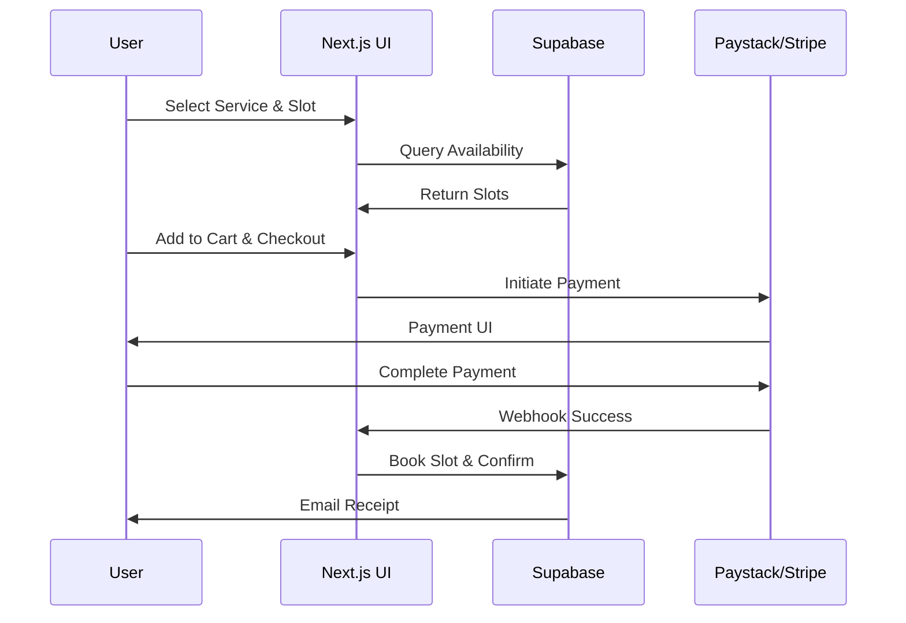

# Spec: Booking Flow & Payments v1.0

## Changelog
- **v1.0 (2025-10-01)**: Initial specification for standardized booking flow and payments integration, fixing audit issues like partial booking functionality (e.g., Instyle: bookings work but e-commerce 404s) and payment mismatches. Emphasizes Supabase for data handling and freemium payment gateways.

## Overview
This specification covers the end-to-end booking flow and payments for the multi-tenant appointment booking platform, ensuring seamless user experiences across tenants. The flow includes service selection, scheduling, confirmation, and payment processing, integrated with Supabase for realtime availability and Paystack/Stripe for payments (freemium tiers). It addresses audit gaps such as incomplete flows (e.g., Instyle's e-commerce integration failures) and downtime by incorporating robust error handling and tenant isolation via resolver.ts. Goals: Production-ready with IaC for payment webhooks, comprehensive tests for transaction integrity, and rollback to prevent revenue loss. Minimal lock-in via portable payment abstractions.

Key benefits:
- Realtime booking with Supabase subscriptions to avoid double-bookings.
- Unified flow for appointments and e-commerce (e.g., product purchases post-booking).
- Tenant-specific pricing/taxes; supports Paystack for African markets, Stripe globally.
- Fixes 404s by linking to enhanced UI components (Stitch-generated).

## Requirements

### Functional Requirements
1. **Service Selection**: Users browse tenant services/products via dynamic UI (integrated with design tokens); filter by availability.
2. **Scheduling**: Calendar view with realtime slots from Supabase; select date/time, add details (e.g., notes).
3. **Cart & Checkout**: Add to cart (useCart hook); proceed to checkout with tenant-specific totals (incl. taxes).
4. **Payment Processing**: Integrate Paystack/Stripe SDKs; handle one-time/subscription payments; confirm via webhooks.
5. **Confirmation & Post-Booking**: Send receipts/emails; update Supabase (e.g., mark slot booked); optional upsell (e-commerce).
6. **Cancellation/Refunds**: Allow user cancellations within policy; process refunds via payment APIs.
7. **Tenant Admin View**: Dashboard for reviewing bookings/payments; export reports.

### Non-Functional Requirements
1. **Reliability**: 99.99% transaction success; idempotent payments to handle retries.
2. **Performance**: Flow completes in <3s; realtime updates <1s latency via Supabase.
3. **Security**: PCI-DSS compliance; no card data stored locally.
4. **Scalability**: Handle 1k bookings/day/tenant; queue heavy ops (e.g., emails) with BullMQ.
5. **Cost**: Freemium Paystack/Stripe (no setup fees); Supabase queries optimized for Spark tier.

## Acceptance Criteria
- [ ] User can select service, view realtime slots, and book without conflicts.
- [ ] Checkout calculates correct totals; payments succeed and update Supabase.
- [ ] Webhook confirms payment; email sent, slot marked booked.
- [ ] E-commerce integration: Post-booking product purchase redirects without 404s.
- [ ] Cancellations update availability; refunds processed if within window.
- [ ] Admin dashboard shows tenant-isolated bookings/payments.
- [ ] Error handling: Failed payments retry or fallback to manual.

## Test Plan
1. **Unit Tests**: Jest for cart logic, payment mocks; validate totals/availability.
2. **Integration Tests**: Test Supabase updates with payment webhooks (using ngrok for local).
3. **E2E Tests**: Playwright for full flow (book, pay, confirm); multi-tenant scenarios.
4. **Payment Tests**: Sandbox modes for Paystack/Stripe; edge cases (declines, duplicates).
5. **Load Tests**: Artillery for 100 concurrent bookings; monitor Supabase perf.
6. **Security Tests**: OWASP ZAP for checkout; verify no PII leaks.
7. **Coverage**: 95% for payment code; include refund simulations.

## Security Considerations
- **Payments**: Use tokenization (no card storage); validate webhooks with signatures.
- **Isolation**: RLS on booking tables (tenant_id filter); Clerk auth for access.
- **Audit Alignment**: Fix auth mismatches in agents by syncing with booking user; migrate Firebase realtime to Supabase.
- **Fraud Prevention**: Rate-limit bookings; CAPTCHA on high-value; log suspicious activity.
- **Data Protection**: Encrypt sensitive fields (e.g., notes); GDPR-compliant consent for emails.
- **Vulnerabilities**: Scan SDK integrations; rotate webhook secrets.

## Rollback Strategy
1. **Pre-Deploy**: Validate payment configs with `scripts/pre-deploy-check.sh`.
2. **Staged Testing**: Deploy to staging; simulate bookings with real payment sandboxes.
3. **Partial Revert**: If webhook fails, queue manual processing; revert DB changes via Supabase transactions.
4. **Full Rollback**: Disable new flow via feature flag; restore from DB backup; refund pending txns.
5. **Monitoring**: `scripts/post-deploy-monitor.sh` for payment errors; alert on failures.
6. **Downtime**: Graceful degradation to manual bookings if payments down.

## Dependencies
- **Tools/Services**: Supabase (realtime/bookings), Paystack/Stripe (payments), Clerk (user auth).
- **Internal**: useCart.ts, resolver.ts (tenant context), Stitch components for UI.
- **External**: Email service (e.g., Resend freemium), webhook queues.
- **Assumptions**: Payment keys in env; Supabase functions for webhooks.
- **Related Specs**: Tenant Onboarding (initial setup), UI Enhancement (booking UI).

## Diagram: Booking Flow

## Simulated Human Review Checklist
- **Completeness**: All sections included; covers e-commerce/booking integration. ✅
- **Clarity**: Flow diagram sequential; requirements actionable. ✅
- **Feasibility**: Builds on existing hooks/services; freemium gateways. ✅
- **Alignment with Audits**: Fixes Instyle flows, 404s, payment issues. ✅
- **Production-Readiness**: Strong on security/tests/rollback for transactions. ✅
- **Overall**: Production-ready; recommend adding tax calc details. ✅