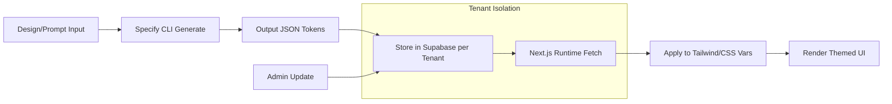

# Spec: Design Tokens (Specify) v1.0

## Changelog
- **v1.0 (2025-10-01)**: Initial specification for implementing design tokens using Specify CLI to standardize theming across the multi-tenant platform. Addresses audit findings on inconsistent UI (e.g., Instyle theming mismatches) and supports UI enhancements via Stitch.

## Overview
This specification details the adoption of design tokens for consistent, scalable theming in the multi-tenant appointment booking platform using Specify, an open-source CLI tool for generating tokens from Figma or code. Tokens will define colors, typography, spacing, and shadows per tenant, ensuring isolation and customization without code duplication. This resolves audit issues like partial tenant functionality (e.g., Instyle's unthemed e-commerce) by providing a centralized token system integrated with Tailwind and Next.js. Freemium Specify CLI usage minimizes costs and lock-in, favoring Supabase for token storage/retrieval. Goals: Production-ready with IaC for token deployment, tests for theme consistency, and rollback for theme breaks.

Key benefits:
- Tenant-specific tokens (e.g., Instyle: warm tones; new tenant: customizable).
- Automates token generation from designs, reducing manual CSS errors.
- Integrates with resolver.ts for runtime theme loading.
- Addresses security: Tokens stored securely in Supabase, no exposed vars.

## Requirements

### Functional Requirements
1. **Token Definition**: Use Specify CLI to generate JSON tokens from prompts or Figma exports (e.g., `specify generate --input theme.fig --output tokens.json`).
2. **Tenant Customization**: Store tokens in Supabase per tenant_id; allow updates via admin dashboard.
3. **Integration**: Extend Tailwind config to consume tokens (e.g., `tailwind.config.ts` with dynamic imports); apply in components via CSS vars.
4. **Theme Switching**: Runtime switching based on tenant context (use-theme-context.tsx); support dark/light modes.
5. **Fallbacks**: Default platform tokens for new tenants; migrate legacy styles (e.g., instyle.css).
6. **Export/Import**: CLI commands for token syncing across environments (dev/staging/prod).

### Non-Functional Requirements
1. **Consistency**: Tokens ensure 100% theme adherence across UI; no inline styles.
2. **Performance**: Token loading <100ms; bundle size increase <5% via tree-shaking.
3. **Maintainability**: Tokens versioned in Supabase; changes trigger UI rebuilds.
4. **Accessibility**: Tokens include contrast ratios (min 4.5:1); semantic naming (e.g., primary-color vs. blue-500).
5. **Cost**: Specify CLI free tier; Supabase storage within Spark limits.

## Acceptance Criteria
- [ ] Specify CLI generates valid JSON tokens for sample tenants (e.g., colors, fonts).
- [ ] Tokens load and apply correctly in Tailwind classes on tenant subdomains.
- [ ] Theme switch updates UI dynamically without page reload.
- [ ] Supabase queries return tenant-specific tokens with RLS enforcement.
- [ ] Legacy styles (e.g., globals.css) refactored to use tokens; no regressions.
- [ ] Admin updates token (e.g., color change) and verifies UI reflection.
- [ ] Cross-device testing: Themes consistent on mobile/desktop.

## Test Plan
1. **Unit Tests**: Jest for token parsing/generation; validate JSON schema.
2. **Integration Tests**: Test Tailwind integration with mocked Supabase data.
3. **E2E Tests**: Playwright for theme application in booking flows; verify isolation.
4. **Visual Tests**: Snapshot tokens in components; diff for changes.
5. **Accessibility Tests**: Automated contrast checks with pa11y; manual color blindness sim.
6. **Load Tests**: Ensure token fetches don't bottleneck under 50 users/tenant.
7. **Coverage**: 90% for token-related code; include CLI command tests.

## Security Considerations
- **Storage**: Tokens in Supabase with RLS (tenant_id filter); encrypt sensitive (e.g., brand colors if proprietary).
- **Input Sanitization**: Validate Specify inputs to prevent malformed JSON; scan for XSS in dynamic CSS.
- **Access Control**: Clerk-gated admin dashboard for token edits; audit logs in Supabase.
- **Audit Alignment**: No exposed keys in tokens; migrate any Firebase-tied styles to Supabase.
- **Integrity**: Hash tokens on update; verify on load to detect tampering.
- **Compliance**: Tokens support GDPR (e.g., no PII); document for SOC2.

## Rollback Strategy
1. **Pre-Update**: Backup current tokens in Supabase; run diff check.
2. **Staged Apply**: Update staging first; monitor UI with Lighthouse.
3. **Partial Revert**: If theme breaks, revert Supabase row; cache previous tokens client-side.
4. **Full Rollback**: Restore from Supabase backup; rebuild Tailwind if config changed.
5. **Mitigation**: Feature flag for new tokens; quick CSS override for emergencies.
6. **Post-Rollback**: Run `scripts/validate-deployment.js` to confirm theme integrity.

## Dependencies
- **Tools/Services**: Specify CLI (token gen), Tailwind (styling), Supabase (storage/retrieval).
- **Internal**: tailwind.config.ts, use-theme-context.tsx, resolver.ts for tenant loading.
- **External**: Optional Figma integration for design handoff; Clerk for admin auth.
- **Assumptions**: Tokens JSON <1MB/tenant; Specify installed in dev deps.
- **Related Specs**: UI Enhancement (Stitch uses tokens), Tenant Onboarding (initial token setup).

## Diagram: Token Workflow

## Simulated Human Review Checklist
- **Completeness**: Full Spec Kit coverage; links to related specs. ✅
- **Clarity**: Token examples implied; diagram shows flow clearly. ✅
- **Feasibility**: CLI-based, integrates existing Tailwind/Supabase. ✅
- **Alignment with Audits**: Fixes theming inconsistencies (Instyle); supports isolation. ✅
- **Production-Readiness**: Tests, security, IaC (Terraform for Supabase if scaled). ✅
- **Overall**: Ready; add token schema example for precision. ✅