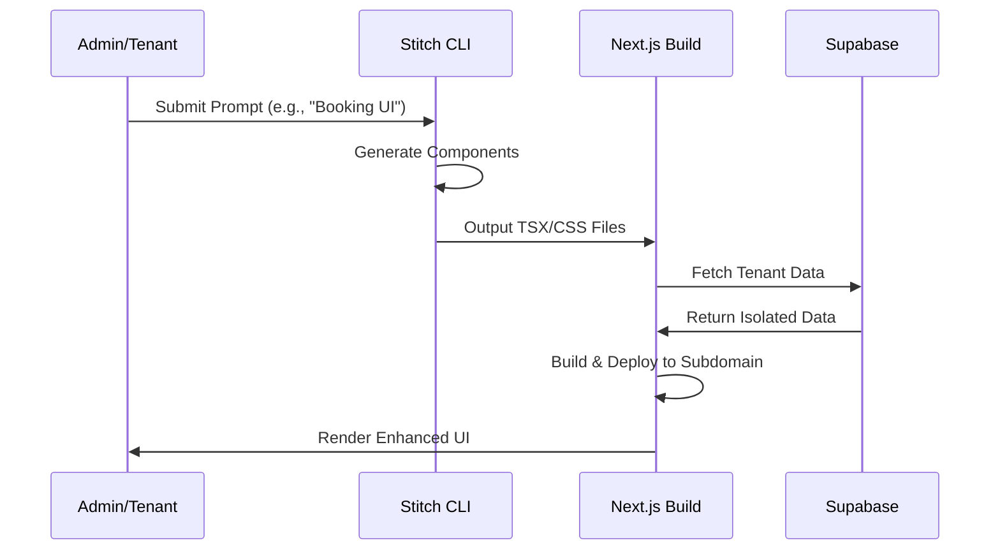

# Spec: UI Enhancement (Stitch) v1.0

## Changelog
- **v1.0 (2025-10-01)**: Initial specification for UI enhancements using Stitch for rapid, tenant-isolated UI generation. Addresses audit issues like main site downtime (404s) and partial tenant UI (e.g., Instyle e-commerce 404s) by standardizing component generation and isolation.

## Overview
This specification defines enhancements to the user interface of the multi-tenant appointment booking platform using Stitch, an open-source tool for AI-driven UI generation from prompts. The focus is on creating dynamic, tenant-specific UIs that improve usability, ensure isolation, and resolve existing issues such as 404 errors on tenant subdomains and inconsistent theming. Stitch will be used in freemium mode (CLI prompts) to generate components like booking forms and dashboards without vendor lock-in. Integration with existing Next.js 14 structure, Supabase for data, and Clerk for auth ensures seamless multi-tenancy. Goals include production-readiness with IaC for deployment, test plans for cross-browser compatibility, and strategies to mitigate downtime during UI updates.

Key benefits:
- Rapid prototyping of tenant-customized UIs via natural language prompts.
- Fixes audit gaps: Better subdomain routing to eliminate 404s, enhanced isolation via resolver.ts.
- Supports realtime updates (e.g., via Supabase) for dynamic elements like availability calendars.
- Minimal dependencies: Stitch for generation, Tailwind for styling (integrated with design tokens spec).

## Requirements

### Functional Requirements
1. **Component Generation**: Use Stitch CLI to generate tenant-specific components (e.g., BookingForm, ProductCard) from prompts like "Create a responsive booking form for hair salon with Supabase integration."
2. **Tenant Isolation**: Render UI based on tenant context from resolver.ts; load custom assets (logos, themes) per tenant.
3. **UI Enhancements**: Add features like drag-and-drop scheduling, realtime availability (Supabase subscriptions), and responsive design for mobile/desktop.
4. **Integration Points**: Hook into existing components (e.g., useCart hook) and services (e.g., WhatsApp bot for confirmations).
5. **Customization**: Allow tenants to tweak generated UI via simple YAML configs (e.g., colors, layouts) without code changes.
6. **Error Handling**: Graceful fallbacks for 404s (e.g., redirect to onboarding if tenant not active).

### Non-Functional Requirements
1. **Performance**: UI loads in <2s (Lighthouse score >90); optimize with Next.js image optimization and code-splitting.
2. **Accessibility**: Ensure ARIA labels, keyboard navigation, and color contrast in generated components (WCAG 2.1 AA).
3. **Scalability**: Support 100+ concurrent users per tenant; use CDN for static assets.
4. **Compatibility**: Cross-browser (Chrome, Firefox, Safari latest); mobile-first with Tailwind.
5. **Cost**: Freemium Stitch CLI (no API costs); leverage existing Supabase bandwidth limits.

## Acceptance Criteria
- [ ] Stitch-generated components render correctly on tenant subdomains without 404s.
- [ ] Tenant isolation: UI elements (e.g., logo, colors) differ per tenant (e.g., Instyle vs. new tenant).
- [ ] Realtime features (e.g., availability updates) reflect changes instantly via Supabase.
- [ ] Customization YAML updates UI without redeploy (via build-time generation).
- [ ] Error pages handle invalid routes gracefully, logging to Supabase.
- [ ] Lighthouse audit passes for performance/accessibility on sample tenant pages.
- [ ] Integration with booking flow: Generated forms submit data correctly to backend.

## Test Plan
1. **Unit Tests**: Jest for individual components (e.g., snapshot testing of Stitch outputs); mock tenant context.
2. **Integration Tests**: Test UI-backend hooks (e.g., form submission to Supabase) with MSW.
3. **E2E Tests**: Playwright scenarios for user journeys (e.g., book appointment on mobile); verify isolation across tenants.
4. **Visual Regression**: Use Percy/Applitools to catch UI breaks post-Stitch generation.
5. **Performance Tests**: Lighthouse CI in pipeline; simulate loads with k6.
6. **Accessibility Tests**: Axe-core audits automated in tests; manual review for complex interactions.
7. **Coverage**: 85%+ for UI code; include prompts validation for Stitch reproducibility.

## Security Considerations
- **Isolation**: Sanitize Stitch prompts to prevent injection; use resolver.ts to enforce tenant boundaries.
- **Content Security**: CSP headers to restrict generated scripts; scan outputs for vulnerabilities.
- **Auth Integration**: Ensure UI respects Clerk sessions; no exposed tenant data in client-side code.
- **Audit Alignment**: Fix exposed keys by migrating any UI-tied Firebase calls to Supabase; use RLS for data fetches.
- **Prompt Security**: Validate YAML configs server-side; limit Stitch to whitelisted templates.
- **Logging**: Track UI errors with tenant context in Supabase logs; alert on anomalies.

## Rollback Strategy
1. **Pre-Deployment**: Run `scripts/pre-deploy-check.sh` including UI diff checks.
2. **Staged Rollout**: Deploy to staging tenant first; monitor with `scripts/post-deploy-monitor.sh`.
3. **Partial Revert**: If generation fails, fallback to cached components; revert resolver changes via Git.
4. **Full Rollback**: Terraform apply previous state for infra; clear Stitch-generated files and rebuild.
5. **Data Safety**: UI changes don't affect backend; use feature flags (e.g., via Next.js) for new components.
6. **Recovery**: For 404s, quick fix via nginx redirects; notify via Slack.

## Dependencies
- **Tools/Services**: Stitch CLI (freemium for UI gen), Next.js 14 (rendering), Tailwind (styling), Supabase (realtime data).
- **Internal**: resolver.ts (tenant routing), existing components/hooks (e.g., use-tenant.ts), scripts for deployment.
- **External**: Clerk (session management), optional Firebase migration for any legacy UI realtime.
- **Assumptions**: Stitch installed via npm; prompts stored in prompts/ directory.
- **Related Specs**: Design Tokens (for theming), Tenant Onboarding (initial UI setup).

## Diagram: UI Generation Flow

## Simulated Human Review Checklist
- **Completeness**: Covers all Spec Kit sections; integrates audit fixes (404s, isolation). ✅
- **Clarity**: Prompts and diagram explain Stitch usage; non-technical terms defined. ✅
- **Feasibility**: Freemium tools viable; builds on existing Next.js/Supabase stack. ✅
- **Alignment with Audits**: Targets UI downtime and tenant inconsistencies (e.g., Instyle). ✅
- **Production-Readiness**: Includes tests, security, rollback; IaC for deploys. ✅
- **Overall**: Production-ready; suggest adding prompt examples in appendix. ✅